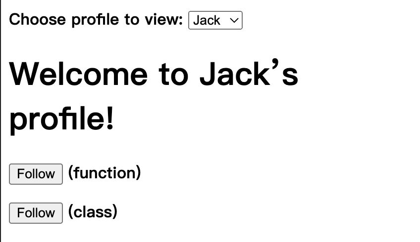
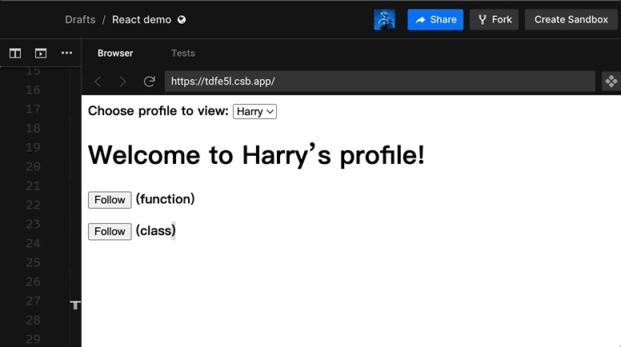
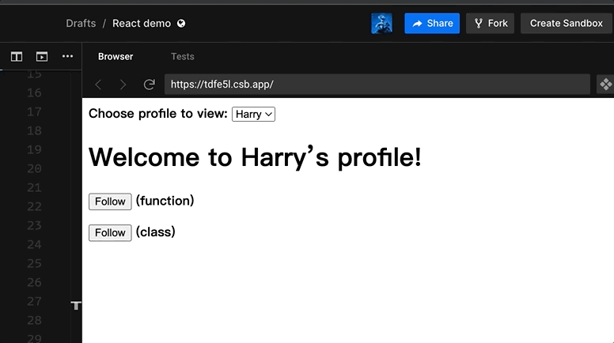
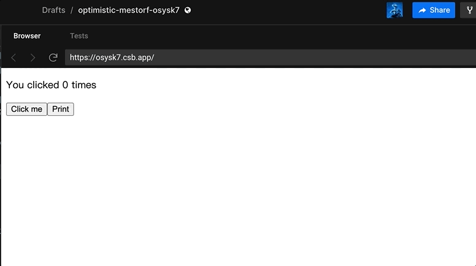

# React 函数式组件 vs 类组件

## 引言

与 React 类组件相比，React 函数式组件究竟有何不同？

这将会是我们本篇讨论的话题，如果你想一句话快速概括函数式组件的特点，那也许是这样：

> 函数式组件就如同一台照相机，它总是捕获当前渲染所用的值，然后生成一份份快照。

## 从一个例子说起

看看下面这个函数式组件:

```jsx
function ProfilePage(props) {
  const showMessage = () => {
    alert('Followed ' + props.user);
  };

  const handleClick = () => {
    setTimeout(showMessage, 3000);
  };

  return <button onClick={handleClick}>Follow</button>;
}
```

它渲染了一个利用`setTimeout`来模拟网络请求，然后显示一个确认警告的按钮。

如果换成类组件我们会怎么写？可能大多数人都会重构成这样：

```jsx
class ProfilePage extends React.Component {
  showMessage = () => {
    alert('Followed ' + this.props.user);
  };

  handleClick = () => {
    setTimeout(this.showMessage, 3000);
  };

  render() {
    return <button onClick={this.handleClick}>Follow</button>;
  }
}
```

他们是等价的吗？或许可以互通？或许不可以互通？他们有什么不同吗？

先在心里想想自己的答案？

**下面进入实验环节，我们把这两个组件放入一个情景中，来探寻他们的奥秘。**



在这个例子中，假设我们有一个低配的微博系统，可以关注你想关注的大 V。

点击 Follow 按钮后，会分别触发我们的函数组件和类组件，3 秒后 alert 提示我们成功关注，并展示我们关注的大 V 名称。

请打开 [SandBox](https://codesandbox.io/s/magical-marco-tdfe5l?file=/src/App.js) 进行体验。

可能现在你还不能发现其中的问题，但是当你点击 Follow 后，马上切换不同的大 V，你会察觉到不对劲。

这是 Function 组件的结果：



这是 Class 组件的结果：



是不是有些恍然大悟？很显然，使用 Class 组件产生的结果不符合实际逻辑。如果我关注一个人，然后切换到了另一个人的主页，我的组件不应该混淆我关注了谁。

进一步解释，我们是关注的 Harry，所以 3 秒后，不管当前的博客页面是不是在 Harry 上，弹窗都应该是提示我们关注了 Harry 才对。

但事实是，Function 组件做到了，Class 组件失败了。

## 解密

为什么会这样呢？

解密之前我需要强调一下，我们目前讨论的东西和 react hooks 一点关系都没有，我们甚至没有使用 hooks！

Hooks 只是函数式组件里的一种工具，但并不是决定函数式组件和类组件异同的因素。

让我仔细看看类组件：

```js
class ProfilePage extends React.Component {
  showMessage = () => {
    alert('Followed ' + this.props.user);
  };

  handleClick = () => {
    setTimeout(this.showMessage, 3000);
  };

  render() {
    return <button onClick={this.handleClick}>Follow</button>;
  }
}
```

这个`showMessage`类方法从 `this.props.user` 中读取数据。

在 React 中 Props 是不可变(immutable)的，所以他们永远不会改变。**然而，`this`是，而且永远是，可变(mutable)的！！！**

事实上，这就是类组件 `this` 存在的意义。**React 本身会随着时间的推移而改变，以便你可以在渲染方法以及生命周期方法中得到最新的实例。**

所以如果在请求已经发出的情况下我们的组件进行了重新渲染，`this.props`将会改变。`showMessage`方法将会从一个“过于新”的`props`中得到了`user`。

其实我们可以把这个过程想象放电影，电影是由一帧一帧组成的，每一帧其实就是一张照片，也可以叫做“快照“。快照是静态的。


我们可以理解成，在 Harry 的主页时，是一张快照，此时 this 指向的是这个快照。3 秒后的快照则是 Peter 主页，this 的指向改变了。

在类组建里，由于调用的是 `this.props.user`，所以 this 指向变了，值自然变了。

请牢记电影与快照的概念，它将会贯穿整个 react 函数式组件。

## 我们来改造一下吧

如果你在看这篇文章之前并不熟悉 React， 你也许会问为什么使用函数式组件不会出现这种情况？

别急，我们就是来讨论这个问题的（尽管上面我们已经知道了最终的效果）。

但在这之前，先想想假设函数式组件不存在。我们将如何解决这个问题？

让我们找找问题出现的根本原因。我们是想找到 Harry 那张快照下的 props 数据，但由于延迟了 3 秒，随着时间的流逝，电影里的快照变了。也就是说，在这个过程中，Harry 快照下的`props`被弄丢了。

所以很显然的回想到，一种方法是在调用事件之前读取`this.props`，然后将他们显式地传递到 timeout 回调函数中去：

```jsx
class ProfilePage extends React.Component {
  showMessage = (user) => {
    alert('Followed ' + user);
  };

  handleClick = () => {
    const { user } = this.props;
    setTimeout(() => this.showMessage(user), 3000);
  };

  render() {
    return <button onClick={this.handleClick}>Follow</button>;
  }
}
```

这种方法就相当于用一个新变量捕获了此时此刻 prop s 的值，并且以后都不可能改变了。

然而，这种方法使得代码明显变得更加冗长，并且随着时间推移容易出错。如果我们需要的不止是一个 props 怎么办？如果我们还需要访问 state 怎么办？如果 `showMessage` 调用了另一个方法，然后那个方法中读取了 `this.props.something` 或者 `this.state.something`，我们又将遇到同样的问题。然后我们不得不将`this.props`和`this.state`以函数参数的形式在被`showMessage`调用的每个方法中一路传递下去。

这样的做法破坏了代码的诗意，并且随着程序的复杂，bug 也会随之而来。

如果看到这你手足无措了，请回顾一下我们面对的根本问题：

**从`this.props`中读取数据太迟了——读取时已经不是我们所需要使用的快照了！**

## 闭包来了

还记得 javaScript 闭包吗？

不能称之为定义的说，闭包就是「函数」和「函数内部能访问到的变量」的总和。

它的最大特点有两个，一个是前面提到的可以在内函数里读取外函数内部的变量，另一个就是让这些变量的值始终保持在内存中而不被销毁。

通常来说我们会避免使用闭包，因为这些保存在内存中的变量会像定时炸弹一样，它会让我们难以想象一个可能会随着时间推移而变化的变量。

但是在 React 中，props 和 state 是不可变得！（或者说，在我们的强烈推荐中是不可变得。）这就消除了闭包的一个主要缺陷。

这就意味着如果你在一次特定的渲染中捕获那一次渲染所用的 props 或者 state，你会发现他们总是会保持一致，就如同你的预期那样。

所以，我们不妨用闭包来改造一下我们的类组件：

```jsx
class ProfilePage extends React.Component {
  render() {
    // Capture the props!
    const props = this.props;

    // Note: we are *inside render*.
    // These aren't class methods.
    const showMessage = () => {
      alert('Followed ' + props.user);
    };

    const handleClick = () => {
      setTimeout(showMessage, 3000);
    };

    return <button onClick={handleClick}>Follow</button>;
  }
}
```

**你会在渲染的时候（当前的快照下）就已经“捕获”了当前的 props！**

这样，在它内部的任何代码（包括`showMessage`）都保证可以得到这一次特定渲染所使用的 props。然后我们可以在里面添加任意多的辅助函数，它们都会使用被捕获的 props 和 state，都会使用当前快照里的状态而不是其他快照的。

**闭包万岁！**

## 还要类组件干嘛

这一下你开心了，因为你解决了问题，满足了需求。

但是类组件不开心了，当你开始在`render`方法中定义各种函数，而不是把它们放到外面，那么使用类组件的意义在哪里？

没错，react 官方因此推出了类组件（之前类组件还不够强大，等到 hooks 推出之后，类组件彻底在被抛弃的边缘徘徊）。

我们可以通过删除类的“包裹”来简化代码：

```jsx
function ProfilePage(props) {
  const showMessage = () => {
    alert('Followed ' + props.user);
  };

  const handleClick = () => {
    setTimeout(showMessage, 3000);
  };

  return <button onClick={handleClick}>Follow</button>;
}
```

就像上面这样，`props`仍旧被捕获了，React 将它们作为参数传递。

**不同于`this`，`props`对象本身永远不会被 React 改变。**

如果你在函数定义中解构`props`，那将更加明显：

```jsx
function ProfilePage({ user }) {
  const showMessage = () => {
    alert('Followed ' + user);
  };

  const handleClick = () => {
    setTimeout(showMessage, 3000);
  };

  return <button onClick={handleClick}>Follow</button>;
}
```

回到开篇的例子，当父组件使用不同的 props 来渲染 `ProfilePage` 时，React 会再次调用 `ProfilePage` 函数。但是我们点击的事件处理函数，函数里的状态全部都是上一次渲染时的快照！它们都保持完好无损！

## 快照？快照！

我一直都很强调这个概念。如果你买过云服务器，那你一定知道快照！你在某个时间结点备份你的快照，当某一天你玩坏了你的服务器，你只需要还原快照即可回到以前的状态。

**所以快照是存储数据的某一时刻的状态记录。**

引言中我们说了什么？

> 函数式组件就如同一台照相机，它总是捕获当前渲染所用的值，然后总是会生成一份份快照。

每次函数式组件被调用渲染时就如同拍摄了一份快照，显然每一张快照都有自己的状态（比如 props 和 state），而函数式组件在每一次渲染中总会存储下当前的状态，它是不变的。

再一次特别强调，迄今为止，我们说的东西与 Hooks 无关！这只是函数式组件与类组件的个人恩怨！

你即使是使用 Hooks，得到的依然是这个结论。

下面这个例子进行演示，你可以在 [SandBox](https://codesandbox.io/s/optimistic-mestorf-osysk7?file=/src/App.js:58-437) 中自己体验。



```jsx
function App() {
  const [count, setCount] = useState(0);

  const showMessage = () => {
    setTimeout(() => {
      alert('Now count: ' + count);
    }, 3000);
  };

  return (
    <div>
      <p>You clicked {count} times</p>
      <button onClick={() => setCount(count + 1)}>Click me</button>
      <button onClick={showMessage}>Print</button>
    </div>
  );
}
```

我们使用 Hooks，并且也用 set 方法去改变的状态，但实际上，这并不起作用。alert 出来的值依然是当 count = 3 的时候的状态。

## 每一次渲染都有自己的快照

上面我们说到，hooks 的使用与否，并不会影响函数式组件的特性，即函数式组件每一次渲染都有它自己的快照。

让我们再来看看代码：

```jsx
function App() {
  const [count, setCount] = useState(0);

  const showMessage = () => {
    setTimeout(() => {
      alert('Now count: ' + count);
    }, 3000);
  };

  return (
    <div>
      <p>You clicked {count} times</p>
      <button onClick={() => setCount(count + 1)}>Click me</button>
      <button onClick={showMessage}>Print</button>
    </div>
  );
}
```

`You clicked {count} times`究竟是什么意思呢？`count` 会“监听”状态的变化并自动更新吗？

这么想可能是学习 React 的时候的第一直觉（特别是如果你接触过 vue，就更会这么想了）。

但结果总是事与愿违的！上面例子中，`count`仅是代表一个数字而已。

它不是神奇的“data binding”, “watcher”, “proxy”，或者其他任何东西。它就是一个普通的数字像下面这个一样：

```jsx
const count = 42;
// ...
<p>You clicked {count} times</p>;
// ...
```

我们的组件第一次渲染的时候，从`useState()`拿到`count`的初始值`0`。当我们调用`setCount(1)`，React 会再次渲染组件，这一次`count`是`1`。如此等等：

```jsx
// During first render
function Counter() {
  const count = 0; // Returned by useState()  // ...
  <p>You clicked {count} times</p>;
  // ...
}

// After a click, our function is called again
function Counter() {
  const count = 1; // Returned by useState()  // ...
  <p>You clicked {count} times</p>;
  // ...
}

// After another click, our function is called again
function Counter() {
  const count = 2; // Returned by useState()  // ...
  <p>You clicked {count} times</p>;
  // ...
}
```

**当我们更新状态的时候，React 会重新渲染组件。每一次渲染都能拿到独立的`count` 状态，这个状态值是函数中的一个常量。**

所以下面的这行代码没有做任何特殊的数据绑定：

```jsx
<p>You clicked {count} times</p>
```

**它仅仅只是在渲染输出中插入了 count 这个数字。**这个数字由 React 提供。当`setCount`的时候，React 会带着一个不同的`count`值再次调用组件。然后，React 会更新 DOM 以保持和渲染输出一致。

这里关键的点在于任意一次渲染中的`count`常量都不会随着时间改变。渲染输出会变是因为我们的组件被一次次调用，而每一次调用引起的渲染中，它包含的`count`值独立于其他渲染。

所以说，千万不要以为 useState 有什么神奇的，它仅仅是一种语法糖，帮我们在变更快照的时候重新赋值我们的数据而已。

同理，不仅每一次渲染有自己的 props 和 state，每一次渲染也有自己的事件处理函数。

依然还是这个例子：

```jsx
function App() {
  const [count, setCount] = useState(0);

  const showMessage = () => {
    setTimeout(() => {
      alert('Now count: ' + count);
    }, 3000);
  };

  return (
    <div>
      <p>You clicked {count} times</p>
      <button onClick={() => setCount(count + 1)}>Click me</button>
      <button onClick={showMessage}>Print</button>
    </div>
  );
}
```

经过刚才关于 count 的讨论，我们已经不敢对函数 showMessage 的工作原理妄下定论了！

没错，`onClick={showMessage}`也绝对不等同于 Vue 中的 `@click`事件。

它究竟是如何工作的呢？

我们发现`count`在每一次函数调用中都是一个常量值。

我们的组件函数每次渲染都会被调用，但是每一次调用中`count`值都是常量，并且它被赋予了当前渲染中的状态值。

这并不是 React 特有的，普通的函数也有类似的行为：

```jsx
function sayHi(person) {
  const name = person.name;
  setTimeout(() => {
    alert('Hello, ' + name);
  }, 3000);
}

let someone = { name: 'Dan' };
sayHi(someone);

someone = { name: 'Yuzhi' };
sayHi(someone);

someone = { name: 'Dominic' };
sayHi(someone);
```

在这个例子中, 外层的`someone`会被赋值很多次（就像在 React 中，*当前*的组件状态会改变一样）。然后，在`sayHi`函数中，局部常量`name`会和某次调用中的`person`关联。因为这个常量是局部的，所以每一次调用都是相互独立的。结果就是，当定时器回调触发的时候，每一个 alert 都会弹出它拥有的`name`。

这就解释了我们的事件处理函数如何捕获了点击时候的`count`值。如果我们应用相同的替换原理，每一次渲染“看到”的是它自己的`count`：

```jsx
// During first render
function Counter() {
  const count = 0; // Returned by useState()  // ...
  function handleAlertClick() {
    setTimeout(() => {
      alert('You clicked on: ' + count);
    }, 3000);
  }
  // ...
}

// After a click, our function is called again
function Counter() {
  const count = 1; // Returned by useState()  // ...
  function handleAlertClick() {
    setTimeout(() => {
      alert('You clicked on: ' + count);
    }, 3000);
  }
  // ...
}

// After another click, our function is called again
function Counter() {
  const count = 2; // Returned by useState()  // ...
  function handleAlertClick() {
    setTimeout(() => {
      alert('You clicked on: ' + count);
    }, 3000);
  }
  // ...
}
```

所以实际上，每一次渲染都有一个“新版本”的`handleAlertClick`。每一个版本的`handleAlertClick`“记住” 了它自己的 `count`：

```jsx
// During first render
function Counter() {
  // ...
  function handleAlertClick() {
    setTimeout(() => {
      alert('You clicked on: ' + 0);
    }, 3000);
  }
  // ...
  <button onClick={handleAlertClick} />; // The one with 0 inside  // ...
}

// After a click, our function is called again
function Counter() {
  // ...
  function handleAlertClick() {
    setTimeout(() => {
      alert('You clicked on: ' + 1);
    }, 3000);
  }
  // ...
  <button onClick={handleAlertClick} />; // The one with 1 inside  // ...
}

// After another click, our function is called again
function Counter() {
  // ...
  function handleAlertClick() {
    setTimeout(() => {
      alert('You clicked on: ' + 2);
    }, 3000);
  }
  // ...
  <button onClick={handleAlertClick} />; // The one with 2 inside  // ...
}
```

这就是为什么例子中，事件处理函数“属于”某一次特定的渲染，当你点击的时候，它会使用那次渲染中`counter`的状态值。

**在任意一次渲染中，props 和 state 是始终保持不变的。**如果 props 和 state 在不同的渲染中是相互独立的，那么使用到它们的任何值也是独立的（包括事件处理函数）。它们都“属于”一次特定的渲染。即便是事件处理中的异步函数调用看到的也是这次渲染中的`count`值。

## Before ending

好了，如果你能阅读到这里，那你一定对于函数式组件与类组件有了自己深刻的理解。

请务必记住快照的概念，其实 react 的每一次渲染，无非就是在制造一个又一个的快照。每一个快照都是静态的，状态不可变的。如果你发现 UI 视图的数据变了，反推那一定此时的快照已经不是原来的快照了。

如果你碰巧发现了 React 还处于 Beta 版的[最新官方文档](https://beta.reactjs.org/learn/state-as-a-snapshot)，你会发现快照这个概念并非我原创。
